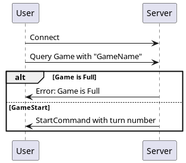
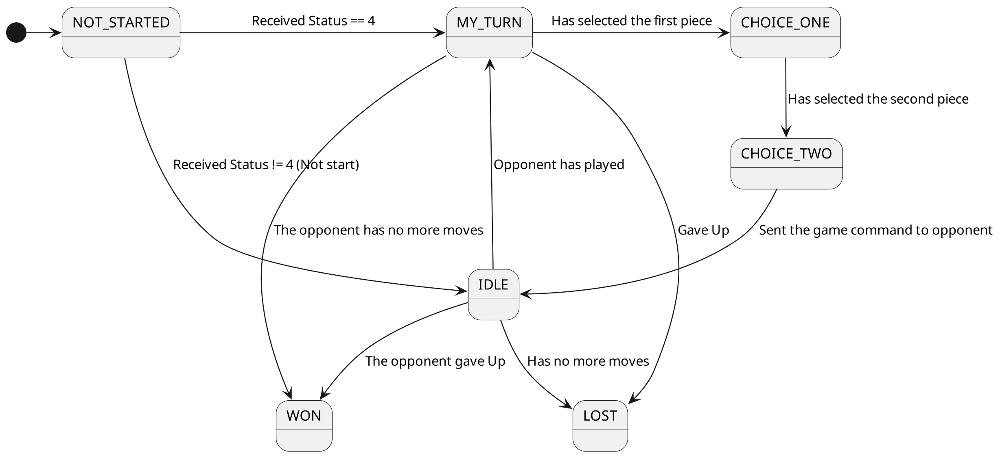

# Solitaire Game

This is an implementation of the game Solitaire, named as "One Left Game" in this
application. Is used QT5 and Linux's sockets to achieve communication.

The code is separated in 3 sections, the `Server` code, which consists of the socket base usage
and the client connection phase, working as a proxy to all games commands. Then we have the `Client`
consisting of the base socket usage and the `GameStateMachine` the one which controls the
game flow, make the calls to the underlying implementation of sockets. Finally, we have
the `UI` code, which is what the Client see and plays.

## How to run:

### Linux

- Arch Based:

```
> sudo pamac install qt5-base 
```

If it doesn't work with `install`, use `build`.

- Debian Based:

```
> sudo apt-get install build-essential qtbase5-dev qt5-qmake cmake
```

To build:
```
> cmake -S . -B build
> cd build && make
```

If the `cmake` returns error of versions, you can easily downgrade for `VERSION 3.22`, or any that is compatible to
your setup, in `CMakeLists.txt`.


To run (inside "build" dir):
```
> ./one_left server; # Starts the server
> # On other terminal, or console
> ./one_left
```

### Windows

Don't.

### Mac

_Maybe_ the qt5 is POSIX, and _maybe_ it can be easily installed with some tweaks to the Mac.
But Apple is not the developer problem, so you should stick to linux.

## Protocols

To make the control via sockets, was created a protocol-like interface between clients.

The overall structure of the protocol looks like this:

```
0 1 2 3 4 5 6 7 8 9 0 1 2 3 4 5 6
+-+-+-+-+-+-+-+-+-+-+-+-+-+-+-+-+
|    Command    |     DATA      |
+-+-+-+-+-+-+-+-+-+-+-+-+-+-+-+-+
|     DATA      |     DATA      |
+-+-+-+-+-+-+-+-+-+-+-+-+-+-+-+-+
|      ...      |      ...      |
```

But before any client can communicate with each other, they need to "ask for a game room"
to the server.

### To Start Game



Server:

- Read 255 Bytes for the game room name
- Put client in a waiting list
- After second client has requested the same Game Room, send both of then an `accept command`
  if the client begins the play, then is sent a 4 in the accept command byte, if not, is sent 1. If there's any
  problem with the connection, is sent a `NULL` byte, so the client knows there's some
  error.

Client:

- Sends a game room request for the client with the desired name
- Receives `accept command` as response and starts with the state as the accept byte
  says.

So, when everything is okay, a co-worker thread runs beside UI, so it can read the data from the
server.

The overall states that the client can have looks like this:



Below there's all the commands that can be sent by the client to the server.

### After Game Startup

Read 1° Byte as Command Type:

1: GAME

```
0 1 2 3 4 5 6 7 8 9 0 1 2 3 4 5 6
+-+-+-+-+-+-+-+-+-+-+-+-+-+-+-+-+
|     From_X    |    From_Y     |
+-+-+-+-+-+-+-+-+-+-+-+-+-+-+-+-+
|      To_X     |     To_Y      |
+-+-+-+-+-+-+-+-+-+-+-+-+-+-+-+-+
```

2: CHAT

```
0 1 2 3 4 5 6 7 8 9 0 1 2 3 4 5 6
+-+-+-+-+-+-+-+-+-+-+-+-+-+-+-+-+
|              LEN              |   LEN * Bytes....
+-+-+-+-+-+-+-+-+-+-+-+-+-+-+-+-+
```

So the next LEN bytes will be plain UNICODE text.

4: OPTIONS

```
0 1 2 3 4 5 6 7 8
+-+-+-+-+-+-+-+-+
|      OPT      |
+-+-+-+-+-+-+-+-+
```

For the option, we have implemented only one, "FLEE", but is open to more 255 options!

The class diagram looks something like this:


